Hero Module
============

Components
-------------
* Image
* Overlay
* Title
* Crest
* Team
* Venue
* Date
* Hashtag
* League/Competition logo
* Broadcaster logo
* Primary link
* Secondary links
* Share tray

Images
-------------
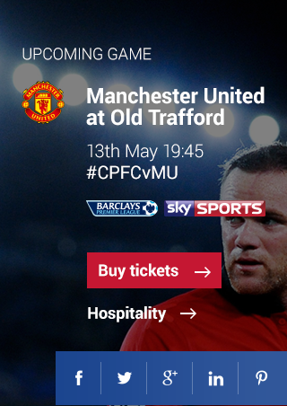

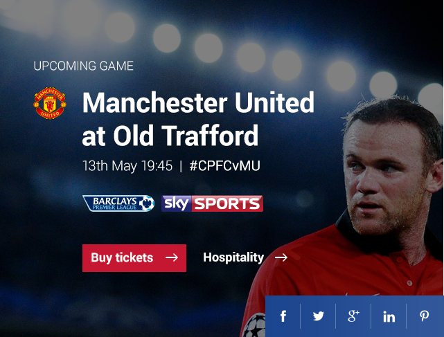

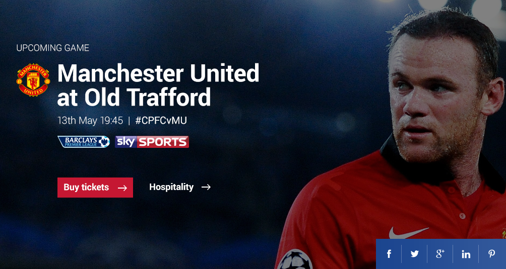

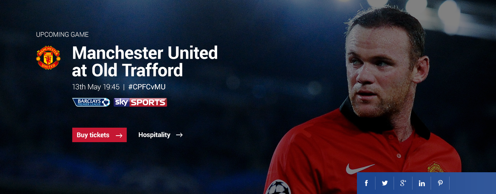

Head 2 Head Guide
============

Components
-------------
* Lines
* Recent form
	* Title
	* Last 5 games x 2
	* Vs
* Strengths (WhoScored)
	* Title
	* List
	* Icons x 2
* Style of play (WhoScored)
	* Title
	* List
	* Icons x 2
* League position graph
	* Crests
	* Graph style
	* Titles
	* Units
	* Relegation zone indicator

Images
-------------
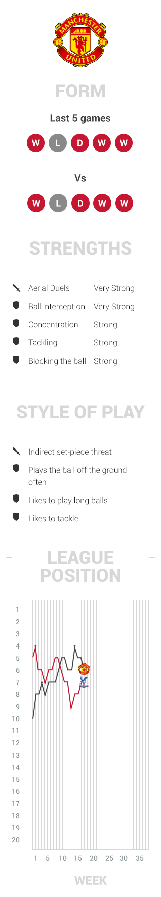

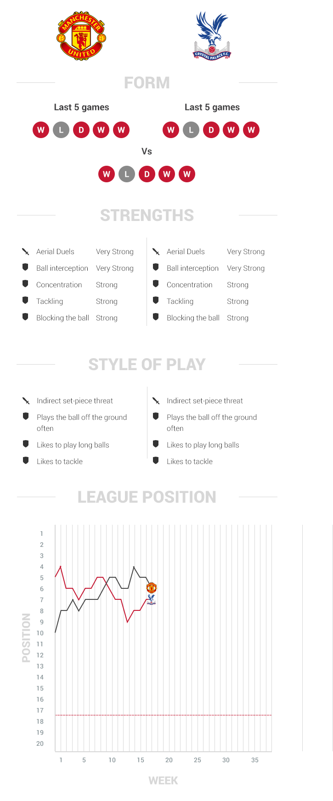

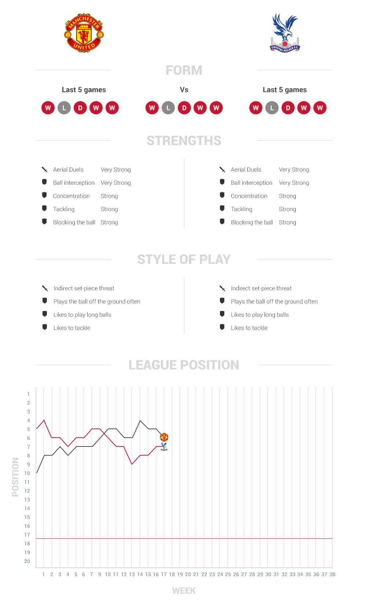

Last Meeting
============

Components
-------------
* Game info
	* Crests
	* Score
	* Team names
	* Date
	* Competition
* Related article
	* Thumbnail image
	* Category
	* Date
	* Title
* Related video
	* Thumbnail image
	* Play icon
	* Category
	* Date
	* Title

Images
-------------
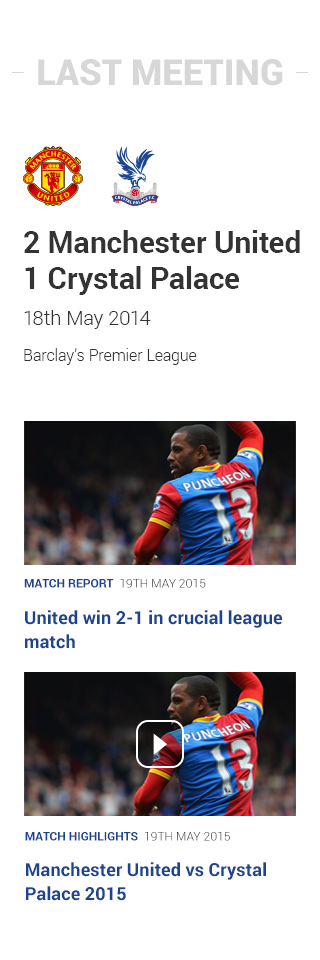

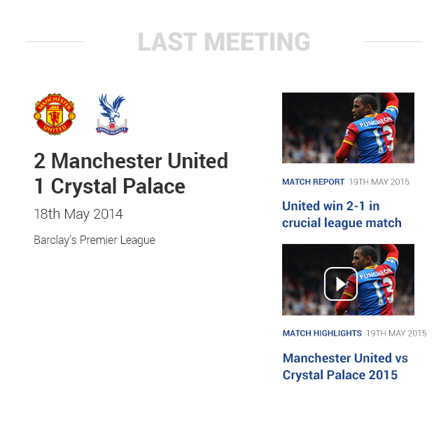

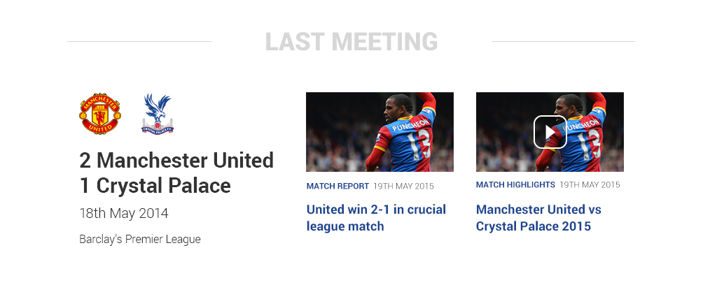

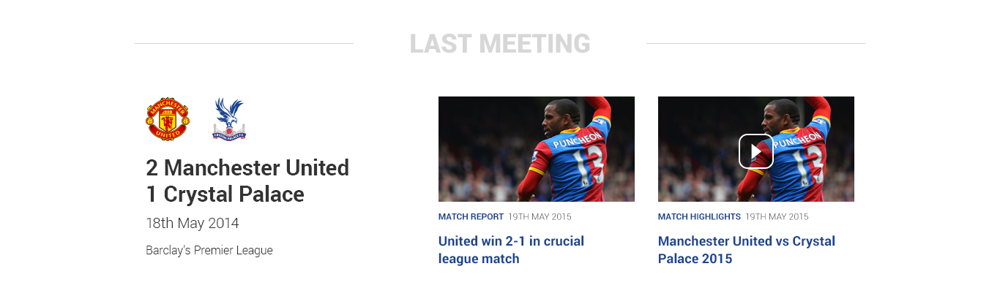

