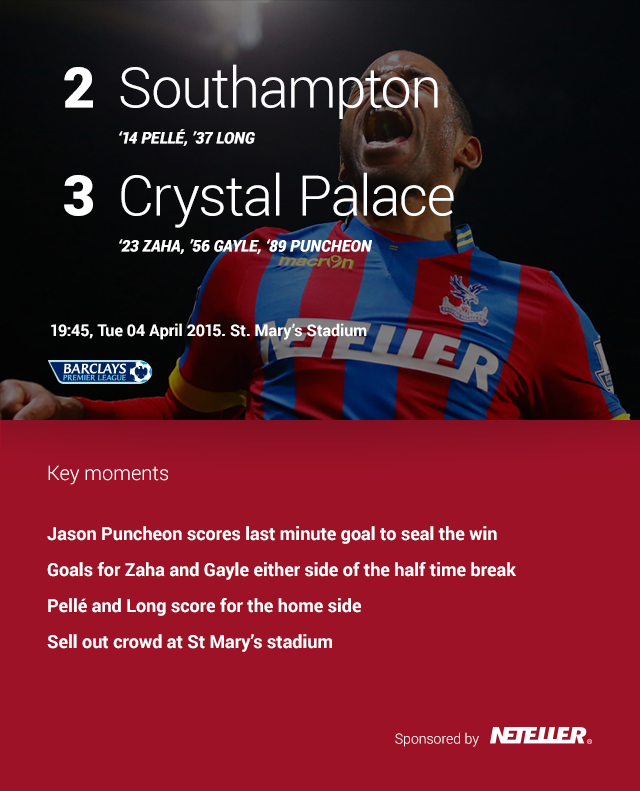
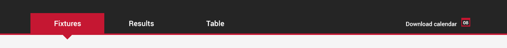

Hero Panel
============

Components
-------------
* Score
* Teams
* Scorers (inc. time)
* Date
* KO time
* Venue
* League / Competition logo
* Key moments panel
	* Title
	* List
	* Overlay background
	* Sponsored area
* Image (transparency)

Images
-------------

Tabs Panel
============

Components
-------------
* View Lineups link

Images
-------------

Article Content
============

Components
-------------
* Title
* Attendance
* Referee
* Into paragraph
* Body copy

Images
-------------

Match Highlights
============

Components
-------------
* Title
* Thumbnail image
* Play icon
* Border
* Title

Images
-------------

Next Game
============

Components
-------------
* Title
* Team
* Venue
* Date & Time
* Primary link
* Secondary link

Images
-------------

Ad Space - MPU
============

Components
-------------

Images
-------------

Related Article Module
============

Components
-------------

Images
-------------

