Hero Panel
============

Components
-------------
* Score
* Teams
* Scorers (inc. time)
* Date
* KO time
* Venue
* League / Competition logo
* Broadcaster logo
* Key moments panel
	* Title
	* List
	* Overlay background
	* Sponsored area
* Image (transparency)
* Radio link

Images
-------------
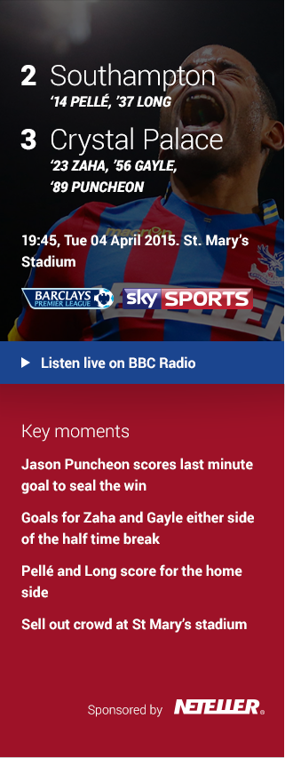

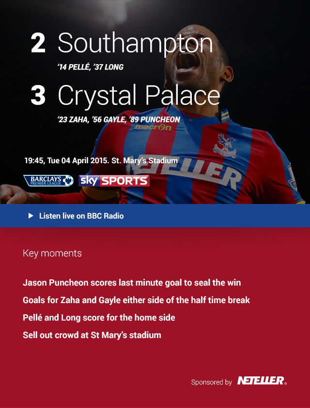

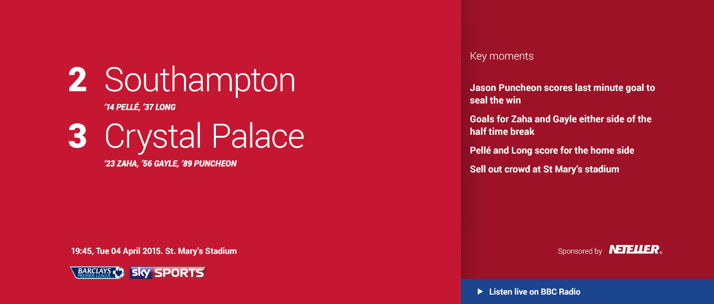

Tabs Panel
============

Components
-------------
* View Lineups link

Images
-------------
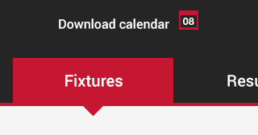

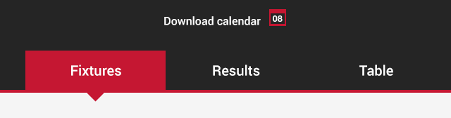

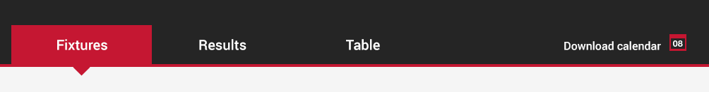

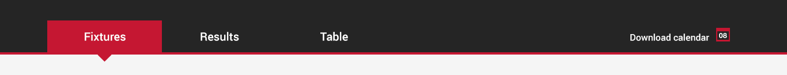

Commentary Stream
============

Components
-------------
* Commentator name
* Comment (simple)
	* Time stamp
	* Title
	* Comment text
* Comment (special)
	* Time stamp
	* Title
	* Comment text
	* Icon set
* Comment (social)
	* Time stamp
	* Author
	* Comment text
	* Network icon
	* Image

Images
-------------
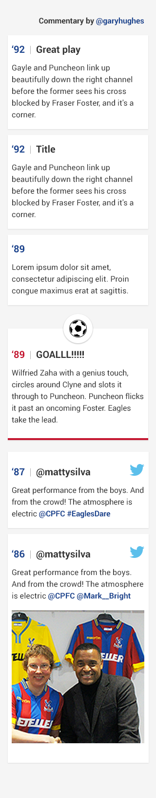

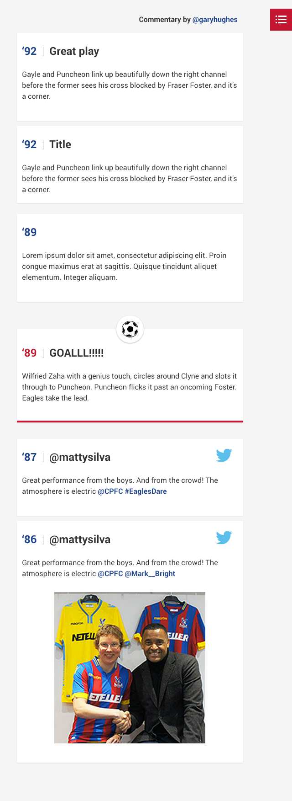

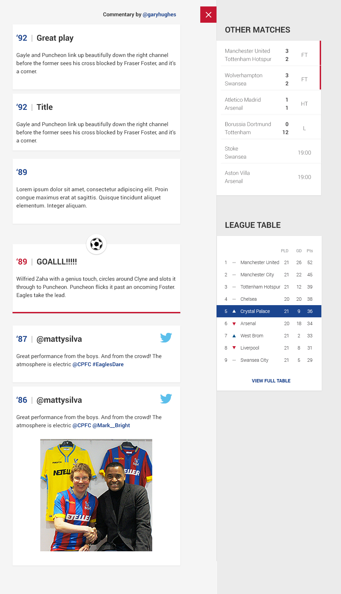

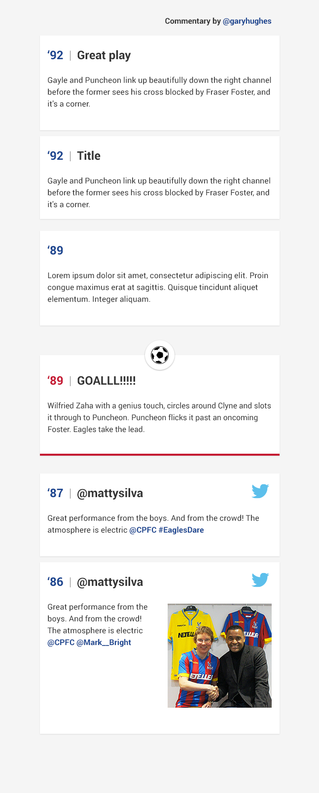

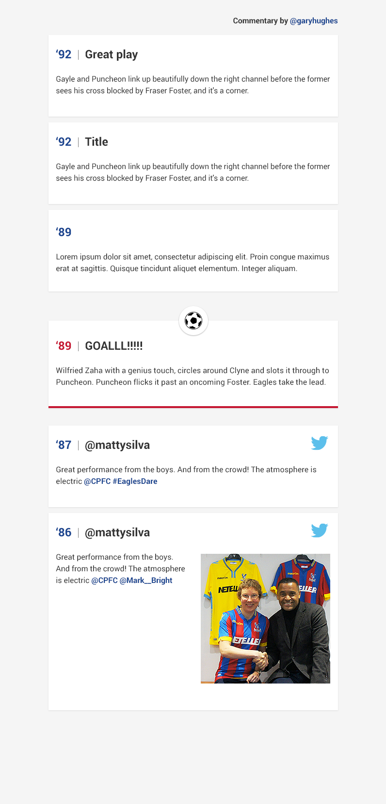

Other Matches
============

Components
-------------
* Teams
* Scores
* Time/status
* Full time indicator

Images
-------------
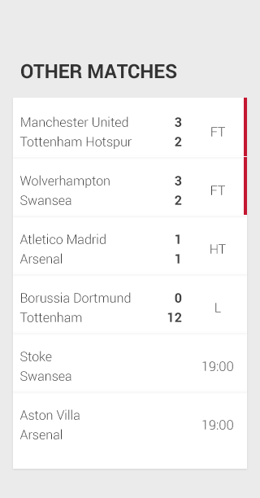

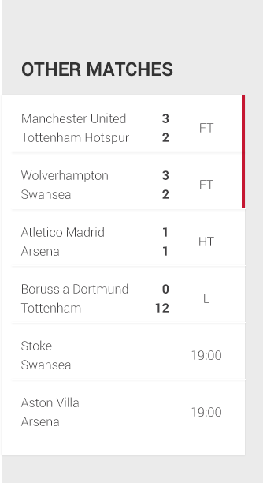

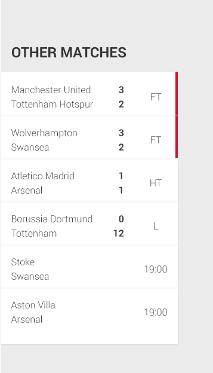

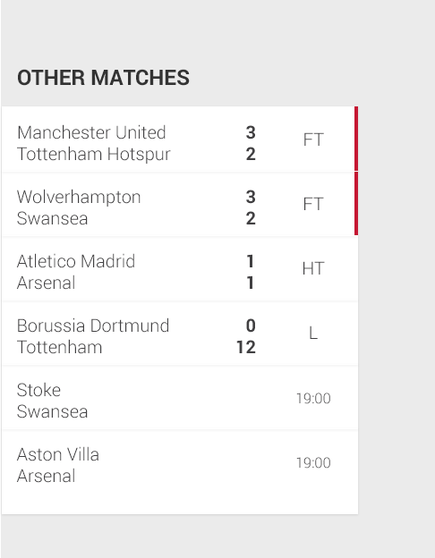

League Table
============

Components
-------------
* Position
* Movement indicator
* Team name
* Played
* Goal difference
* Points

Images
-------------
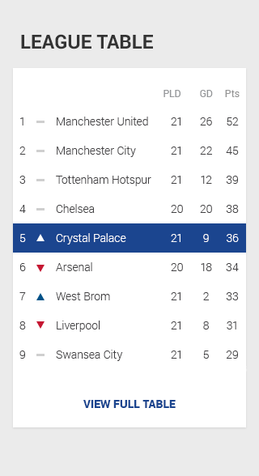

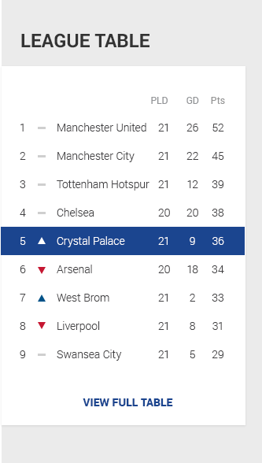

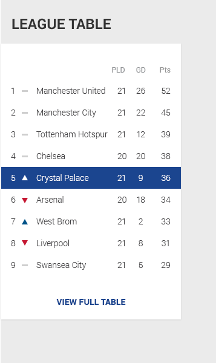

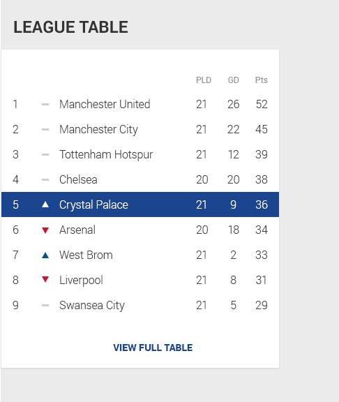

Lineups Pushdown
============

Components
-------------
* Show/Hide button
* Team crests
* Formation text
* Pitch visualisation
* Shirt icon (SVG)
* Player names

Images
-------------
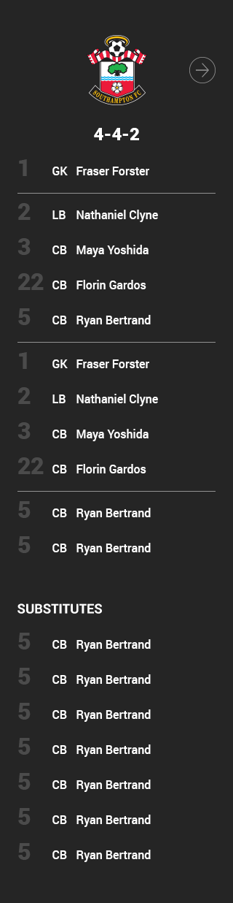

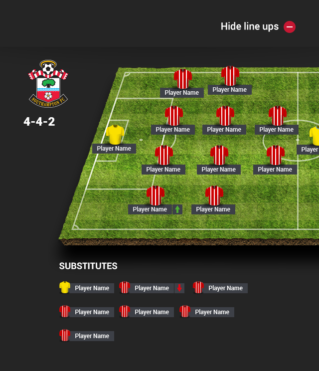

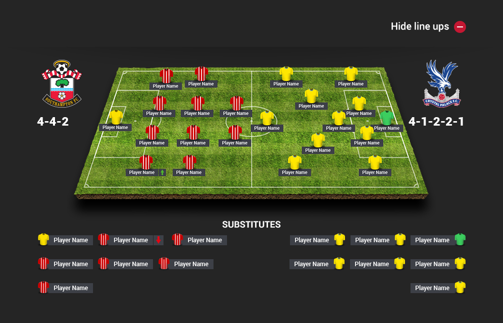

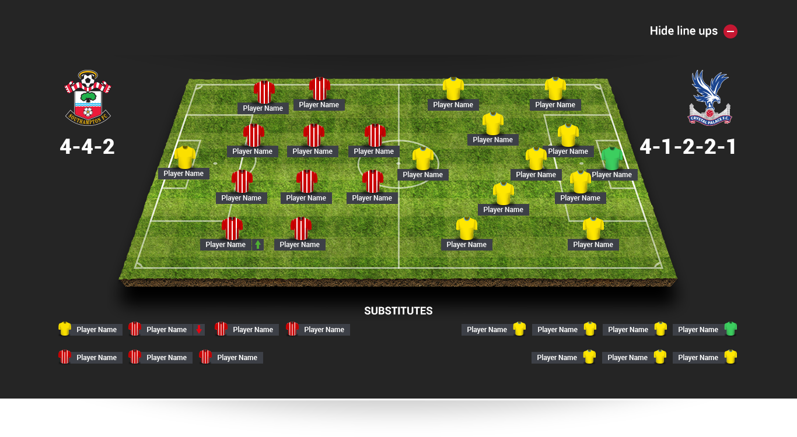

Lineups Pushdown (Mobile)
============

Components
-------------
* Show/Hide button
* Team crests
* Paddle
* Formation text
* Shirt number
* Position acronym
* Player names
* Dividers

Images
-------------

