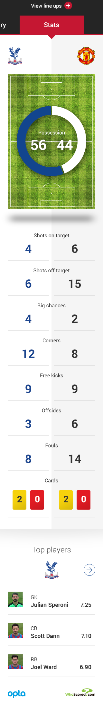
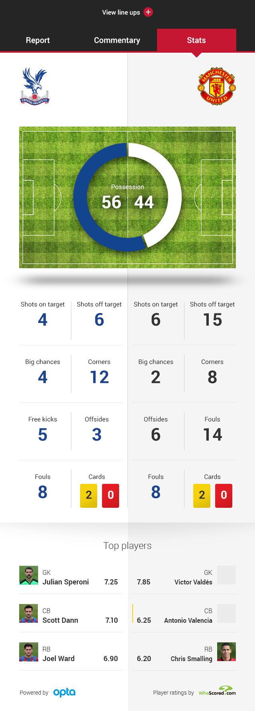
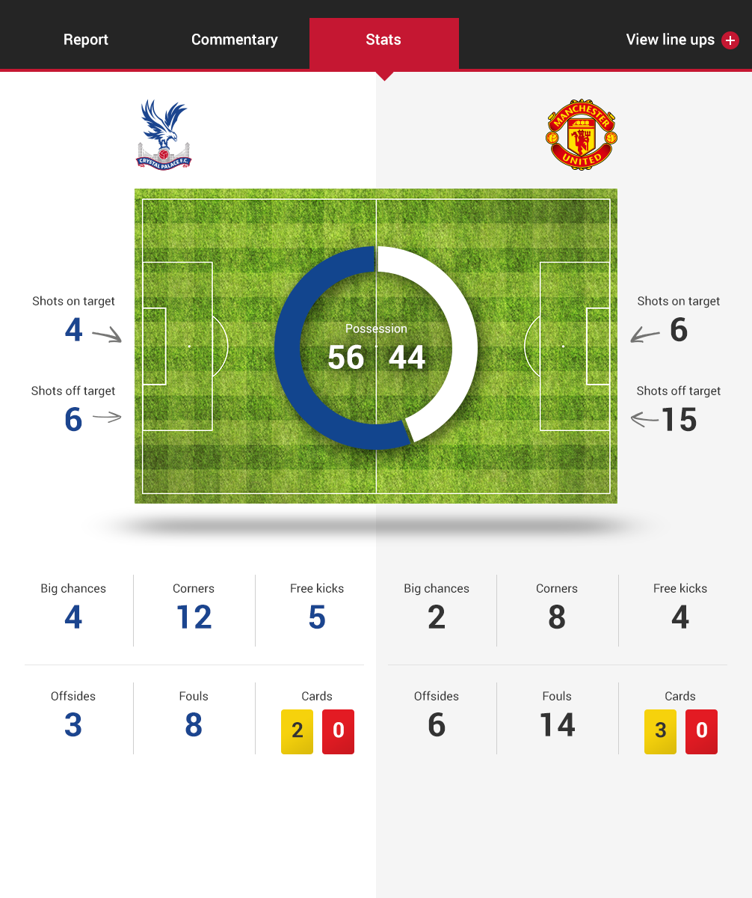
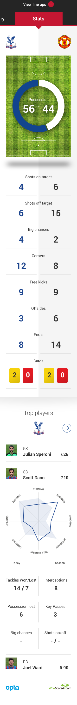
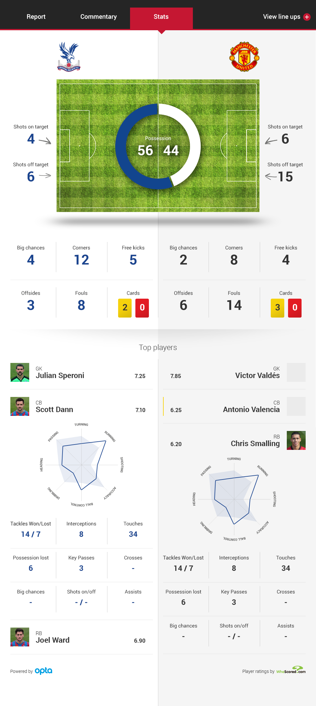
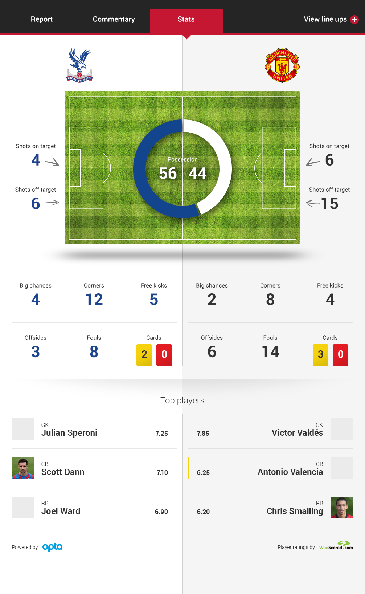
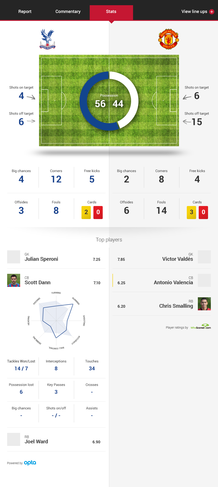
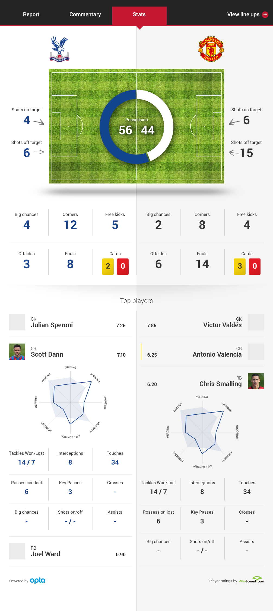

Stat Panel
============

Components
-------------
* Crests
* Pitch visualisation
* Value titles
* Values
* Pie chart
* Card icons

Images
-------------

Top Players
============

Components
-------------
* Title
* Player thumbnail
* Position acronym
* Player name
* Player rating (WhoScored)
* Card indicator
* Radar graph
* Value titles
* Value
* Data provider logos

Images
-------------

