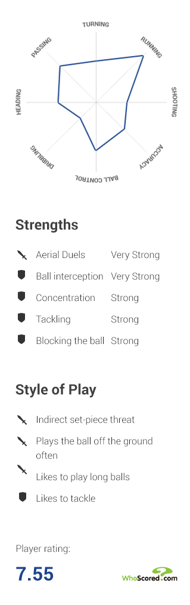
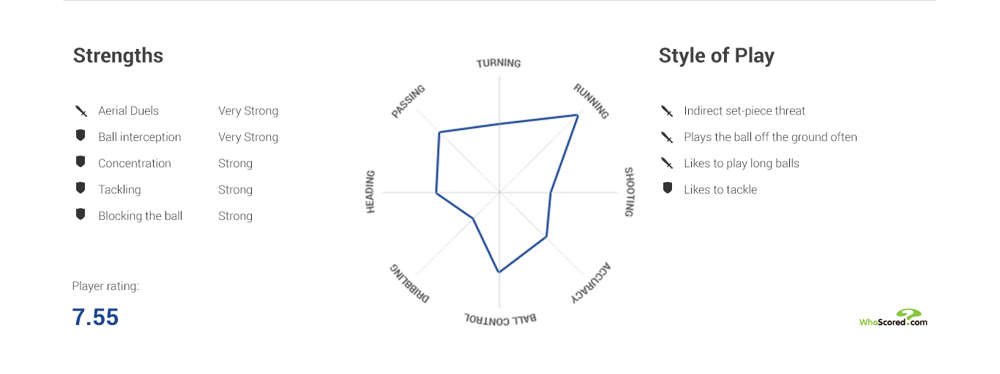

Hero Panel
============

Components
-------------
* Image
* Gradient overlay
* Thumbnail image
* Shirt number
* Player name
* Gallery link (optional)

Images
-------------

Player Info
============

Components
-------------
* Title
* Intro paragraph
* Body copy
* Facts list
	* Name
	* Position
	* Nick name
	* DoB
	* Nationality
	* Height
	* Weight
	* Date signed

Images
-------------

Share Tray
============

Components
-------------

Images
-------------

WhoScored Data Module
============

Components
-------------
* Strengths (2 x icons required)
* Radar graph
* Style of play
* Player rating
* Supplier logo

Images
-------------

Opta Stats - General Set
============

Components
-------------
* General set
	* Value title
	* Value
	* Cards icons

Images
-------------

Opta Stats - Passing
============

Components
-------------
* Module title
* Value titles
* Values
* Passing visual

Images
-------------

Opta Stats - Outfield Player Possession
============

Components
-------------
* Module title
* Value titles
* Value
* Heat map pitch visual

Images
-------------

Opta Stats - Outfield Player Attack
============

Components
-------------
* Module title
* Value titles
* Values
* Player visual
* Pitch & goal visualisation (grid)

Images
-------------

Opta Stats - Outfield Player Defense
============

Components
-------------
* Module title
* Value titles
* Values

Images
-------------

Opta Stats - Goalkeeper Defense
============

Components
-------------
* Module title
* Value titles
* Values
* Goal visualisation
	* Shots saved
	* Goals
	* Legend

Images
-------------

