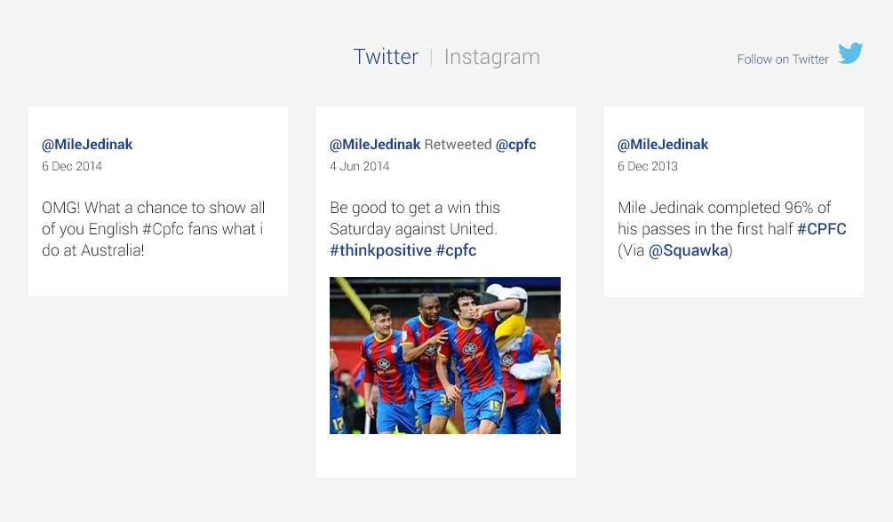
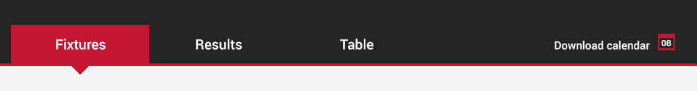
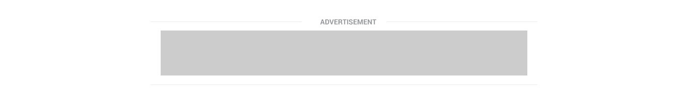
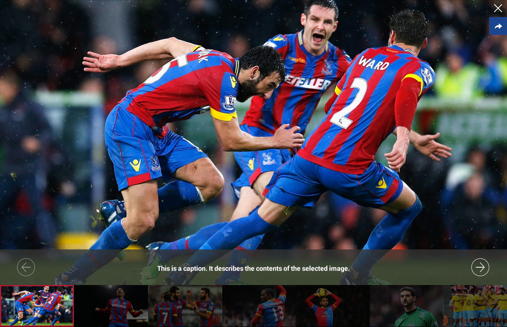

Promo - Game
============

Components
-------------
* Title
* Crest
* Team
* Venue
* Date & Time
* Primary link
* Secondary link
* Image (transparency)
* Overlay background

Images
-------------

Promo - Shop
============

Components
-------------
* Category
* Title
* Image
* Overlay background
* Link
* Image

Images
-------------

Embeddable Gallery
============

Components
-------------
* Image
* Paddles
* Overlay
* Title

Images
-------------

Feature Box
============

Components
-------------
* Title
* Background
* Image
* Subject
* Title
* Synopsis
* Link

Images
-------------

Related Article Module
============

Components
-------------
* Dividing line
* Title
* 3 x article links

Images
-------------

Quote Box - Full Width
============

Components
-------------
* Background panel
* Speech mark icon
* Quote
* Author

Images
-------------

Social Module - Full Width
============

Components
-------------
* Background panel
* Follow link
* Network icon
* Tweet
	* Background panel
	* Twitter handle
	* Date
	* Content

Images
-------------

Embeddable Video
============

Components
-------------
* Video image
* Play icon
* Category
* Title
* Sponsor area

Images
-------------

Tabs
============

Components
-------------
* Selected
* Non-selected
* Hover state
* Swipe
* Border

Images
-------------

Ad Space - Variable
============

Components
-------------
* Title
* Leaderboard
* Dividing lines

Images
-------------

Ad Space - MPU
============

Components
-------------
* MPU

Images
-------------

Loader
============

Components
-------------

Images
-------------

Share Tray
============

Components
-------------

Images
-------------

Pull Quote
============

Components
-------------
* Speech mark icon
* Quote
* Author

Images
-------------

Related Video Module
============

Components
-------------
* Dividing line
* Title
* 3 x video links

Images
-------------

Image Gallery Overlay
============

Components
-------------
* Image
* Close icon
* Share tray
* Paddles
* Caption panel
	* Background
	* Caption text
* Preview thumbnails
	* Selected image indicator

Images
-------------

